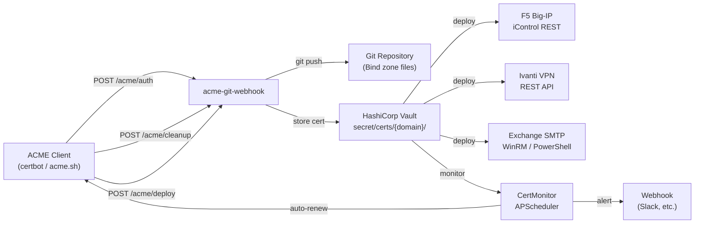

# acme-git-webhook

FastAPI webhook that provisions ACME DNS-01 challenges via Git-managed Bind zone files, stores certificates in HashiCorp Vault, deploys them to network appliances (F5 Big-IP, Ivanti VPN, Exchange SMTP), and monitors expiration with optional auto-renewal.

## What problem does it solve?

Most ACME DNS-01 workflows require a DNS provider with a REST API. If you run authoritative Bind nameservers backed by a Git repository (zone files in version control, CI/CD pipeline for deployment), there is no API to call. This webhook bridges the gap — it modifies zone files directly, commits and pushes changes to Git, and lets your existing DNS pipeline propagate them.

## Architecture

## How it works

1. The **ACME client** calls `/acme/auth` → the webhook injects a `_acme-challenge.<domain>. IN TXT "<validation>"` record into the correct Bind zone file, commits, and pushes to Git.
2. **DNS propagation** is optionally verified by polling public nameservers.
3. The ACME client calls `/acme/cleanup` → the TXT record is removed.
4. On success, `/acme/deploy` stores the full certificate chain and private key in **HashiCorp Vault**.
5. **Target deployment** is triggered via `POST /deploy/{domain}` and pushes the certificate to F5, Ivanti, Exchange, or any custom target.
6. The **certificate monitor** (APScheduler) periodically scans Vault, sends expiry alerts, and optionally runs a `renew_command` to auto-renew.

## Key features

- **DNS-01 challenge** — no port 80 or 443 needed; works with wildcard domains
- **Git-native** — zone files are plain Bind format, version-controlled, CI/CD-friendly
- **Vault storage** — certificates stored securely in HashiCorp Vault KV engine
- **Pluggable deploy targets** — built-in F5, Ivanti, Exchange; extend via `DeployTarget` ABC
- **Wildcard support** — `*.example.com` resolved to `example.com.zone`; stored as literal `*` in Vault paths; sanitized for F5 object names
- **DNS propagation check** — configurable nameservers, timeout, polling interval
- **Expiration monitoring** — configurable `warn_days` thresholds, Slack/webhook alerts
- **Auto-renewal** — runs `certbot renew` (or any command) before expiry
- **Legacy `f5` migration** — old `f5.hosts` config is auto-migrated to the `targets` system
